# 🏗️ Local Perplexity AI - Architecture Documentation

## Overview

**Local Perplexity AI** is an open-source implementation of Perplexity AI that runs 100% offline using **Azure AI Foundry Local** and **LangGraph**. The system performs web search, content synthesis, and intelligent reasoning to answer user questions with cited references.

### Key Technologies
- **LangGraph**: Orchestration framework for multi-step AI workflows
- **Azure AI Foundry Local**: Local LLM inference engine
- **Phi-4-mini**: Query generation and content summarization model
- **DeepSeek-R1**: Reasoning and response generation model
- **Tavily API**: Real-time web search integration
- **Streamlit**: Web-based user interface
- **Python 3.11+**: Core runtime

---

## Project Structure Diagram

```mermaid
graph TB
    subgraph ProjectRoot["📁 Local Perplexity AI Root"]
        Config["⚙️ config.py<br/>Configuration & Logging"]
        Schemas["📋 schemas.py<br/>Pydantic Models"]
        Prompts["📝 prompts.py<br/>LLM Prompts"]
        Utils["🔧 utils.py<br/>Tavily Client Wrapper"]
        LLMClient["🤖 llm_client.py<br/>Azure Foundry Wrapper"]
        Perplexity["🌎 perplexity.py<br/>Main Workflow & UI"]
    end
    
    subgraph Dependencies["📦 External Dependencies"]
        LangGraph["LangGraph<br/>Graph Orchestration"]
        AzureAI["Azure AI Foundry<br/>Local LLM Inference"]
        Tavily["Tavily API<br/>Web Search"]
        Streamlit["Streamlit<br/>Web Interface"]
        Pydantic["Pydantic<br/>Data Validation"]
    end
    
    Perplexity -->|uses| LLMClient
    Perplexity -->|uses| Schemas
    Perplexity -->|uses| Prompts
    Perplexity -->|uses| Utils
    Perplexity -->|uses| Config
    
    LLMClient -->|HTTP Requests| AzureAI
    Utils -->|API Calls| Tavily
    
    Perplexity -->|Graph Execution| LangGraph
    Perplexity -->|UI Rendering| Streamlit
    
    Schemas -->|Data Model| Pydantic
    LLMClient -->|Request/Response| Pydantic

    style ProjectRoot fill:#e1f5ff
    style Dependencies fill:#f3e5f5
    style Perplexity fill:#c8e6c9
    style Config fill:#fff9c4
    style LLMClient fill:#ffe0b2
```



---

## Component Interaction Diagram


---

## Data Flow Architecture

```mermaid
flowchart LR
    Start[("👤 User Input")] 
    
    Start -->|Question| BuildQueries["🔍 Query Generator<br/>Phi-4-mini"]
    BuildQueries -->|Queries List| SpawnResearch["📊 Spawn Researchers<br/>Parallel Execution"]
    
    SpawnResearch -->|Query 1| Search1["🌐 Web Search 1<br/>Tavily"]
    SpawnResearch -->|Query 2| Search2["🌐 Web Search 2<br/>Tavily"]
    SpawnResearch -->|Query N| SearchN["🌐 Web Search N<br/>Tavily"]
    
    Search1 -->|URL| Extract1["📄 Extract Content<br/>Tavily Extract API"]
    Search2 -->|URL| Extract2["📄 Extract Content<br/>Tavily Extract API"]
    SearchN -->|URL| ExtractN["📄 Extract Content<br/>Tavily Extract API"]
    
    Extract1 -->|Raw Content| Summary1["✏️ Summarize 1<br/>Phi-4-mini"]
    Extract2 -->|Raw Content| Summary2["✏️ Summarize 2<br/>Phi-4-mini"]
    ExtractN -->|Raw Content| SummaryN["✏️ Summarize N<br/>Phi-4-mini"]
    
    Summary1 -->|QueryResult| Accumulate["📦 Accumulate Results<br/>State aggregation"]
    Summary2 -->|QueryResult| Accumulate
    SummaryN -->|QueryResult| Accumulate
    
    Accumulate -->|All Results| Reasoning["💭 Reasoning & Synthesis<br/>DeepSeek-R1"]
    Reasoning -->|Final Text| Format["📌 Format Response<br/>Add Citations"]
    Format -->|Final Output| End[("✅ User Response")]
    
    style Start fill:#c8e6c9
    style End fill:#c8e6c9
    style BuildQueries fill:#ffe0b2
    style Reasoning fill:#bbdefb
    style Search1 fill:#f8bbd0
    style Search2 fill:#f8bbd0
    style SearchN fill:#f8bbd0
```



---

## System Architecture Diagram


---

## Deployment Architecture


---

## LangGraph Workflow State Machine

```mermaid
stateDiagram-v2
    [*] --> START
    
    START --> build_first_queries
    
    note right of build_first_queries
        Input: user_input (string)
        Action: Call Phi-4-mini with build_queries prompt
        Output: List of 3-5 search queries
        State Update: queries = [...]
    end
    
    build_first_queries --> spawn_researchers
    
    note right of spawn_researchers
        Input: queries list
        Action: Create parallel Send nodes
        Output: Multiple single_search tasks
        Control: Conditional edges
    end
    
    spawn_researchers --> single_search
    
    note right of single_search
        Input: One query string
        Action: 1. Tavily search(query)
               2. Tavily extract(url)
               3. Phi-4-mini summarize()
        Output: QueryResult {title, url, resume}
        State Update: queries_results += [result]
        Execution: PARALLEL for N queries
    end
    
    single_search --> final_writer
    
    note right of final_writer
        Input: user_input + all queries_results
        Action: Call DeepSeek-R1 with build_final_response prompt
               Format with numbered citations
        Output: final_response with references
        State Update: final_response = formatted_text
    end
    
    final_writer --> [*]
    
    state ReportState {
        [*] --> StateVars
        StateVars : user_input: str
        StateVars : queries: List[str]
        StateVars : queries_results: List[QueryResult]
        StateVars : final_response: str
    }
```

---

## Key Architectural Characteristics

### 1. **Cloud-Native Design with Local Execution**
- Runs entirely offline using Azure AI Foundry Local
- No dependency on cloud LLM endpoints during inference
- Optional Tavily API is the only external dependency (web search)

### 2. **Scalability & Parallelism**
- LangGraph enables parallel execution of multiple web searches
- Each query is processed independently and concurrently
- Results are accumulated automatically using Pydantic's `Annotated[List[...], operator.add]`

### 3. **Resilience & Error Handling**
- Structured error handling at each node
- Fallback mechanisms for content extraction failures
- Logging at all critical points for debugging

### 4. **Separation of Concerns**
- **Configuration** (`config.py`): Centralized settings
- **Data Models** (`schemas.py`): Pydantic models for type safety
- **Prompts** (`prompts.py`): Decoupled prompt templates
- **LLM Integration** (`llm_client.py`): Abstraction layer for model calls
- **Orchestration** (`perplexity.py`): Main workflow logic

### 5. **Type Safety**
- Full Pydantic model validation
- Structured outputs from LLMs using `with_structured_output()`
- Python 3.11+ type hints throughout

---

## Azure Service Integration

### Azure AI Foundry Local
- **Purpose**: Local LLM inference engine
- **Models**: Phi-4-mini (5B), DeepSeek-R1 (7B)
- **Integration**: HTTP REST API at `http://127.0.0.1:52576`
- **Configuration**: `FOUNDRY_ENDPOINT`, `FOUNDRY_API_KEY` in `.env`

### Tavily Search API
- **Purpose**: Real-time web search and content extraction
- **Methods**: `search()` for web results, `extract()` for content
- **Configuration**: `TAVILY_API_KEY` in `.env`

---

## Technical Implementation Details

### Request/Response Flow

**1. Query Generation**
```
User Input → Phi-4-mini → JSON: {"queries": ["Q1", "Q2", "Q3"]}
```

**2. Parallel Search & Summarization**
```
Query → Tavily Search → URL Results
              ↓
         Tavily Extract → Raw Content
              ↓
         Phi-4-mini → QueryResult {title, url, resume}
```

**3. Reasoning & Response**
```
All QueryResults → DeepSeek-R1 → Final Response with [Citations]
```

### State Management
- **State Type**: `ReportState` (Pydantic BaseModel)
- **Accumulation**: Uses `operator.add` for auto-accumulating `queries_results`
- **Type Safety**: All field types are explicitly defined

### Error Handling Strategy
- HTTP error logging in `llm_client.py`
- URL extraction failures logged but non-blocking
- Try-catch around JSON parsing with fallback
- Comprehensive logging at INFO/ERROR levels

---

## Component Types

| Component | Type | Purpose | Technology |
|-----------|------|---------|-----------|
| Streamlit App | UI Layer | User interface | Streamlit 1.43+ |
| LangGraph Engine | Orchestration | Workflow management | LangGraph 0.3.5+ |
| Phi-4-mini | AI Model | Query generation, summarization | Azure AI Foundry |
| DeepSeek-R1 | AI Model | Reasoning, response generation | Azure AI Foundry |
| Tavily Client | External API | Web search | Tavily Python SDK 0.5.1+ |
| Foundry Local | Inference Engine | Model inference | Azure AI Foundry Local |

---

## Deployment Model

### Deployment Pattern: **Hybrid Local-Cloud**

```
┌─────────────────────────────────────────────────┐
│     LOCAL EXECUTION (100% Offline Capable)      │
│  ┌──────────────────────────────────────────┐   │
│  │  Python Application + Streamlit UI       │   │
│  │  + Azure Foundry Local (LLM Inference)   │   │
│  │  + TinyDB (Optional Local Cache)         │   │
│  └──────────────────────────────────────────┘   │
│                      │                          │
│     (Only Optional)  │                          │
│                      ↓                          │
│     EXTERNAL SERVICES (Optional)                │
│     - Tavily Search API (for web results)      │
│     - Azure AI Foundry (for model updates)     │
└─────────────────────────────────────────────────┘
```

### Infrastructure Requirements
- **Compute**: Single machine (CPU or GPU)
- **Memory**: 16GB+ (for simultaneous model loading)
- **Storage**: 20GB+ (for models + dependencies)
- **Network**: Optional internet (for Tavily API)
- **Port**: 8501 (Streamlit), 52576 (Foundry Local)

---

## Cost Optimization Strategies

1. **Model Quantization**: Uses GGUF quantized models (Phi-4-mini, DeepSeek-R1)
2. **Local Inference**: Eliminates cloud API costs
3. **Parallel Processing**: Efficient resource utilization
4. **Selective Content Extraction**: Limits to 4000 characters per URL
5. **Optional Caching**: TinyDB for repeated queries

---

## Security Considerations

1. **API Keys**: Stored in `.env` file (excluded from git)
2. **Local Execution**: No data sent to cloud LLM endpoints
3. **Model Source**: Azure AI Foundry (authenticated)
4. **HTTP Only**: Local Foundry uses unencrypted HTTP (acceptable for local use)

---

## Performance Characteristics

| Operation | Typical Duration | Bottleneck |
|-----------|------------------|-----------|
| Query Generation | 2-5 sec | Phi-4-mini inference |
| Single Search | 10-20 sec | Tavily API + content extraction |
| Parallel N Searches | 10-20 sec | Parallel execution efficiency |
| Response Generation | 5-10 sec | DeepSeek-R1 inference |
| **Total E2E** | **20-40 sec** | LLM inference time |

---

## Future Enhancement Opportunities

1. **Multi-Model Support**: Support additional local models
2. **Advanced Caching**: Implement semantic caching for repeated queries
3. **User Feedback Loop**: Track answer quality and refine prompts
4. **API Endpoint**: REST API wrapper for remote access
5. **Batch Processing**: Support for multiple concurrent users
6. **Retrieval Augmentation**: Integration with local document databases
7. **Browser Extension**: Direct integration with user browsers

---

## Summary

**Local Perplexity AI** demonstrates a modern, scalable architecture for building intelligent search and reasoning systems using:
- **Local-first design** for privacy and offline capability
- **LangGraph orchestration** for complex multi-step workflows
- **Azure AI Foundry Local** for powerful local LLM inference
- **Modular Python architecture** for maintainability and extensibility

The system successfully replicates Perplexity AI's core functionality while maintaining complete control over data, inference, and costs.
